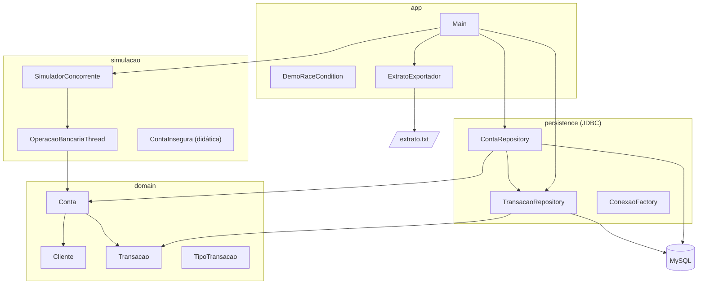
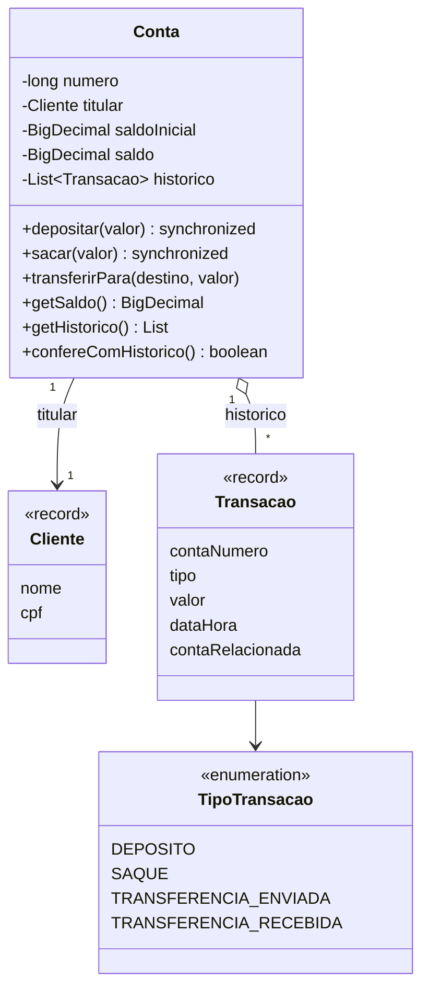

# Arquitetura proposta

Arquitetura em **camadas** com regra de dependência para dentro: o domínio não conhece ninguém.

## Diagrama de classes do domínio

## Decisões de projeto

| Decisão | Motivo |
|---|---|
| Um objeto `Conta` por número de conta, compartilhado entre threads | O cadeado do `synchronized` é o próprio objeto; dois objetos para a mesma conta não se protegeriam. |
| Ordem de bloqueio pelo número da conta | Critério fixo e igual para todas as threads, elimina ciclo de espera (deadlock). |
| Persistência depois da simulação, em lote | Mantém I/O e banco fora dos locks. |
| `Conta.retirarNaoPersistidas()` | Rodar a gravação de novo não duplica transações. |
| `Conta.restaurar()` | Permite recuperar a conta e o extrato entre execuções sem o domínio conhecer JDBC. |
| Repositories sem commit | Quem orquestra (`Main`) decide o limite da transação JDBC. |

## Fluxo de uma transferência

1. Thread chama `origem.transferirPara(destino, valor)`.
2. Ordena as duas contas pelo número → `primeira`, `segunda`.
3. `synchronized (primeira) { synchronized (segunda) { ... } }`
4. Dentro: verifica saldo → debita → credita → registra 2 transações (tudo atômico).
5. Sai dos blocos; os locks são liberados automaticamente.
